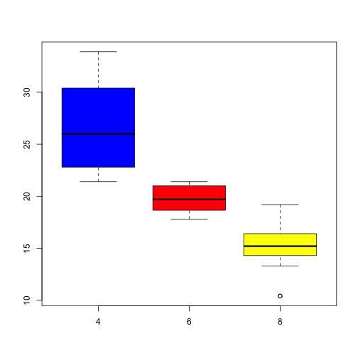
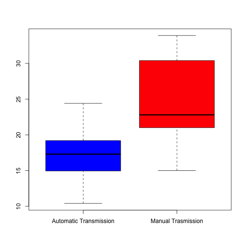
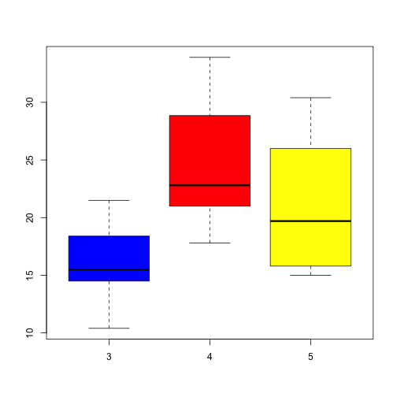

ShinyAppPresentation
========================================================
author: Thota Vinay Babu
date: 5 Nov2016
autosize: true

Introduction
========================================================
This is a Shiny Application.
Here we use CARS Dataset to 
we create a UI(User Interface) to display MILES per 
GALLON Plots based on the variable selected

The UI has a listbox control which allows the user to select the following variables
- Cylinders
- Transmission
- Gears

Explanation
========================================================
The code has two files ui.R and server.R :
 - ui.R provides 
    - Selector for the  3 variable
 

 - server.R has
    - logic for Generation of BoxPlot based on the variable selected in the ui.R
  and is achieved using the reactive expression -> reactive( {.....})

Plot with Variable :Cylinders
========================================================
This plot is displayed when the user selects the variable Cylinders

```
mpg ~ cyl
```



Plot with Variable :Transmission
========================================================
This plot that is displayed when the user selects the variable Transmission

```
mpg ~ am
```


Plot with Variable :Gears
========================================================
This plot that is displayed when the user selects the variable Gears

```
mpg ~ gear
```


